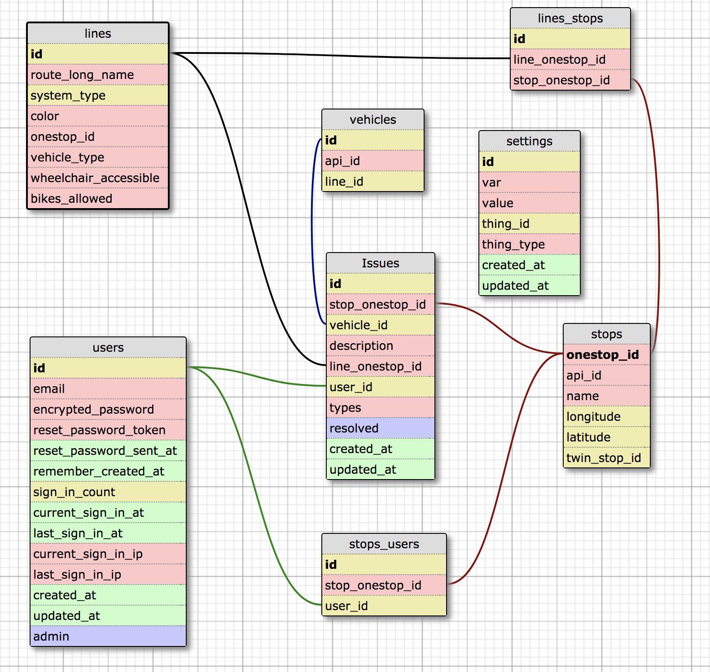

## Contributing to Caravan

Thanks for being here! Our project has grown out of a regional hackathon and is now part of Chi Hack Night, a weekly civic tech meeting.

...but enough about our history. If you're ready to get started with the project, read on!

## Resources and Links

To ease the learning and involvement curve of the project, we have a few resources to look over as you wish. Some of these will be helpful to understand the project's motivations itself, while some are general administration resources.

* The contributing guidelines document. Oh, hey, you're already here!
* Project Slack and discussion channels. These are WIP and require some discussion on our end before we figure this out completely, so we have no links here yet. Check back very soon.
* Bugs can be reported through [GitHub Issues][issues].
* Wiki: Hey, look at that, we have a wiki too! As of this document's construction, it's pretty vacant, but don't be shy. A lot of this project is still in concept development while features are produced, so start a conversation [here][wiki].
* GTFS Primer: This project heavily relies on the General Transit Feed Specification, originally developed by Google but now widely supported by various agencies. If you are unfamiliar with formatting of GTFS packages and what the project was in general, check out [Google's documentation on the matter](https://developers.google.com/transit/gtfs/).
* Very soon, the platform will be moving to [Transitland](https://transit.land/) data, which is a curated database of open GTFS data for transit systems around the world.
* Chicago Transit Authority: This project was born in Illinois and mostly lives in Chicago, so many of our testers and contributors are currently using [CTA GTFS data](http://www.transitchicago.com/developers/gtfs.aspx). Our first full prototype will be built on CTA data.

## Existing Schema Design

## Testing
To test that your install of this platform is correct on the data that we are currently using, download "google_transit.zip" from http://www.transitchicago.com/downloads/sch_data/ and then follow the directions to launch the platform to the local host in the README.md file. You can also use data from a wide variety of other transit systems.

## Development environment details

Original development occurred on Canonical's [Ubuntu](https://www.ubuntu.com/) 16.04 LTS, and packages used for creating the platform were oriented around support for this OS. The project runs using Ruby (2.3.0) on Rails (5.0.1), and is typically evaluated with a simple `rails -s` to run a local server.

As we continue initiation phases of this project, we'll have more details to share here. Check back soon.

## Submitting and Requesting Changes

If you have something fresh to throw in the project, but don't feel like contributing directly, feel free to fork this repository. We do ask that, both for central contributors to the project and those who work on the fringes of it, that most sets of modifications are submitted through _pull requests_. Here's what you should do.
* Create a sparkling new copy or branch just for your emendations.
* Monitor discussion and use best judgment to participate in ongoing issues, which may involve your solution.
* When all done, send it over by opening a pull request:
  * Give a general summary of everything that you did. It doesn't have to be lengthy, especially if the contributions are relatively small.
  * If this is relevant to an open issue (or a few), mention them in the request. We also recommend you write in commit titles and/or descriptions about what issues were fixed (again, if applicable).
  * Requests or features that warrant a large explanation should be posted about on the Wiki for further conversation, along with a link to the pull request.

## Bug Reports and Issues

We use the GitHub Issues platform tied into this repository to manage most feature and issue discussions. If you found something that went haywire, have suggestions, or need help, go there first.

* Templates:
  * What is wrong:
  * Exact steps to recreate bug (if possible):
  * Error Log:

* First bugs for Contributors
  * Edit framework to accomodate different data sets from other transit centers

## New Feature Requirements

New Features must stay within the spirit of the original project: making transportation bettter. Submit new feature requests on the wiki and the community can discuss them. Features deemed needed or intriguing will be used to create issues and milestones.

## Style Guide / Coding conventions
We utilize the Airbnb style guide. Specifics about the style can be found [here](http://airbnb.io/projects/styleguides/). In order to help keep Ruby style consistent we use [Robocop](bocop.readthedocs.io/en/latest/).

### RuboCop: Better Style Through Static Code Analysis
The [RuboCop](https://github.com/bbatsov/rubocop) tool can lint ruby files for style violations that would be otherwise tedious to memorize
and apply consistently. It provides an agreed-upon style 'baseline' so that contributors can focus on higher-level code structure and decisions.

* `rake rubocop` will run rubocop against all (.rb) files in `app`, `lib`, and `test`.
* `bundle exec rubocop <filename>` will run rubocop against a specific file.
* `bundle exec rubocop --auto-correct` will run rubocop and fix issues if possible
* While it would be nice if you would update code to follow suggested styles, keep in mind that rubcop
  can be overridden if needed (see 'Disabling Cops within Source Code' in the [RuboCop docs](https://rubocop.readthedocs.io/en/latest/)).
* RuboCop style is (mostly) based on the Ruby on Rails style (via the [rubocop-rails gem](https://github.com/toshimaru/rubocop-rails)).

## Code of Conduct
This is a constructive environment. No discrimination against any members of this team and community will be tolerated here.

## Recognition model
We value every bit of energy that is devoted to this project. If you have contributed to the project through a pull request, issue and evaluation management, or in some other way, you can ask for recognition in the repository's [CONTRIBUTORS.md][contributors] file.

## Where can I ask for help?
The wiki is specifically there to encourage discussion among community members. If you have any problems that Google can't solve, feel free to post them on the wiki.

[issues]: https://github.com/CaravanTransit/Caravan-App/issues
[wiki]: https://github.com/CaravanTransit/Caravan-App/wiki
[contributors]: https://github.com/CaravanTransit/Caravan-App/blob/master/CONTRIBUTORS.md
